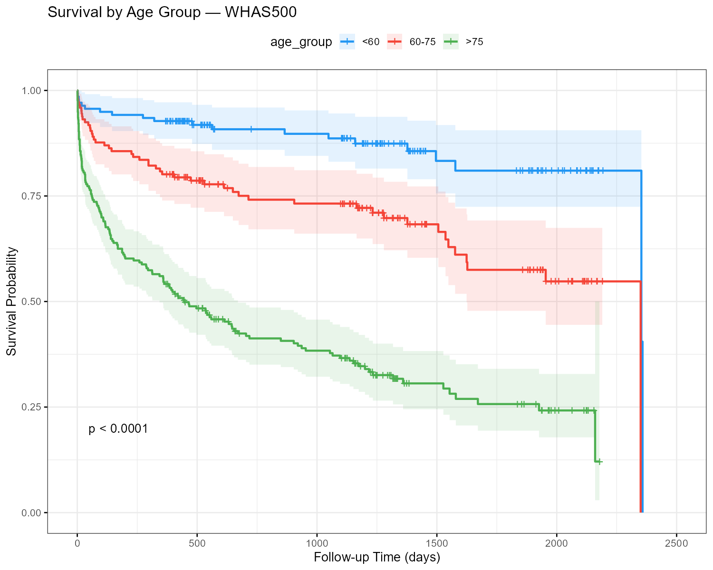
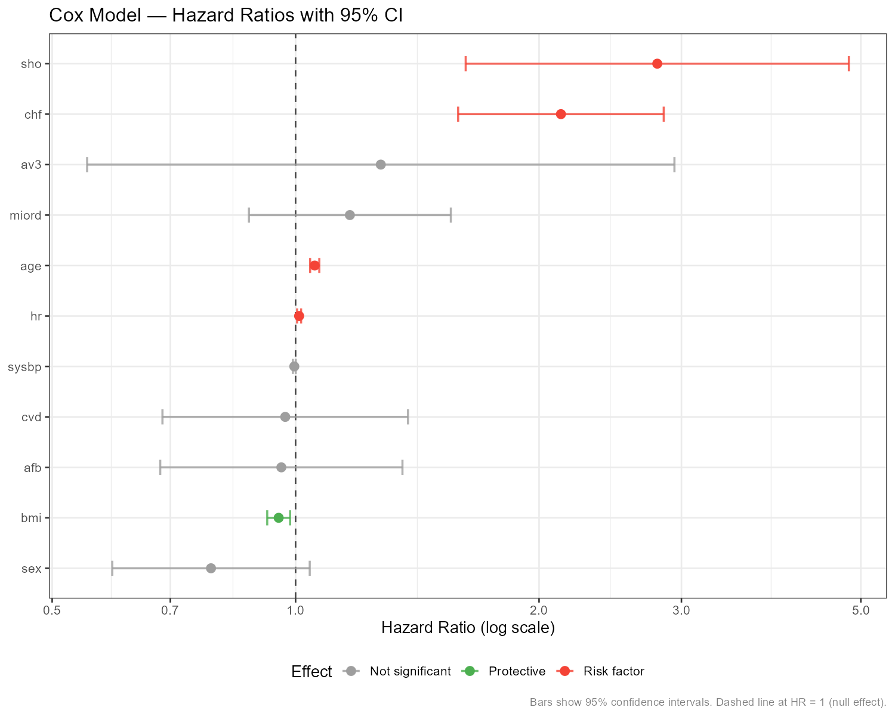

# Patient Survival & Outcome Prediction

**Survival Analysis · Machine Learning · SHAP Explainability · R + Python**

A full clinical research pipeline combining R survival analysis and Python ML
for patient mortality prediction on the Worcester Heart Attack Study (WHAS500).

---

## What it does

| Component | Tool | Output |
|---|---|---|
| Kaplan-Meier curves | R (survival) | Survival function plots + at-risk tables |
| Log-rank test | R (survival) | Significance of survival differences |
| Cox PH model | R (survival) | Hazard ratios + forest plot |
| ML classification | Python (sklearn, XGBoost, LightGBM) | AUC-ROC, F1, calibration |
| SHAP global | Python (shap) | Feature importance beeswarm + bar |
| SHAP local | Python (shap) | Per-patient waterfall explanations |
| SHAP interaction | Python (shap) | Feature dependence plots |
| Research report | Quarto | Combined R + Python HTML report |
| CLI | Typer | `predict run --input patients.csv` |

---

## Quick start

```bash
git clone https://github.com/<your-username>/patient-survival-prediction
cd patient-survival-prediction
python -m venv .venv && source .venv/bin/activate
pip install -r requirements-dev.txt
pip install -e .          # installs the predict CLI
cp .env.example .env

# Step 1: Run Python pipeline (downloads data, trains models)
predict train --dataset whas500

# Step 2: Run R survival analysis
Rscript r/run_analysis.R

# Step 3: Render the research report
quarto render report.qmd

# Step 4: Make predictions on new patients
predict run --input new_patients.csv --output results.csv --explain
```

Full setup guide: **[VSCODE_GUIDE.md](VSCODE_GUIDE.md)**

---

## Datasets

| Dataset | N | Target | Source |
|---|---|---|---|
| WHAS500 | 500 | Mortality + survival time | Worcester Heart Attack Study (free) |
| UCI Heart Disease | 303 | Heart disease presence | UCI ML Repository (free) |

Both download automatically on first run.

---

## Model performance (WHAS500 test set)

| Model | AUC-ROC | Avg Precision | F1 |
|---|---|---|---|
| Logistic Regression | 0.880 | 0.832 | 0.796 |
| Random Forest | 0.875 | 0.788 | 0.773 |
| LightGBM | 0.853 | 0.799 | 0.756 |
| XGBoost | 0.853 | 0.772 | 0.787 |

Logistic Regression is the default (`predict run` / `SurvivalPredictor`) —
best AUC on this dataset, and its coefficients are directly interpretable.

Cox model C-index: ~0.76

---

## Sample output

<table>
<tr>
<td></td>
<td></td>
</tr>
<tr>
<td align="center"><sub>Survival differs significantly by age group (log-rank p &lt; 0.0001)</sub></td>
<td align="center"><sub>CHF and cardiogenic shock roughly double the hazard; BMI is mildly protective</sub></td>
</tr>
</table>

> These are snapshots from one run, committed to `assets/` for display here.
> They are **not** regenerated automatically — if you change the data,
> features, or models, regenerate via `Rscript r/run_analysis.R` and
> recommit the updated PNGs from `data/results/` if you want this section
> to stay current.

Full report (all charts, tables, and interpretation): **[report.pdf](report.pdf)**
— GitHub renders it inline, no need to clone or run anything. Same caveat
as above: it's a committed snapshot, not auto-regenerated on every change.

Prefer plain language over hazard ratios? **[docs/project_summary.pdf](docs/project_summary.pdf)**
is a one-page, non-technical summary of the same findings.

---

## CLI reference

```bash
predict run      --input patients.csv --output results.csv  # predict
predict run      --input patients.csv --explain              # + SHAP
predict train    --dataset whas500                           # train
predict evaluate --dataset whas500                           # evaluate
predict info     --dataset whas500                           # feature guide
```

---

## Structure

```
patient_survival/    installable Python package (predict CLI)
src/
  data/              extract, transform, features
  models/            train, evaluate, shap_explainer
  visualisation/     plots
r/
  survival.R         Kaplan-Meier + Cox PH model
  plots.R            ggplot2 survival plots
  run_analysis.R     R pipeline entry point
notebooks/
  00_eda.ipynb       data dictionary, missingness, VIF, significance tests
  01_ml_pipeline.ipynb   train and compare models
  02_shap_analysis.ipynb global + local SHAP explanations
report.qmd           Quarto research report
```

> ⚠️ Research use only. Not validated for clinical decision-making.
